# [VIEW RESULTS](./viz8.html)
To skip straight to view resume results, go to [viz8.html](./viz8.html)

# Ensure that the Repo has the following structure:
```
- CLEAN.sh
- CODE
- DATA
- README.md
- RUN.sh
- viz6.html
- viz7.html

  - CODE
    - 1_gen_embeddings.py
    - 2_prep_rot_inputs.py
    - 3_run_rot.py
    - 4_denorm.py
    - 5_viz.py
    - 6_tokviz.py
    - rot_class.py
    - rule_of_thumb.py

  - DATA
    - classification.csv
```


# Then from the main directoy (and with all python dependencies from reqs.txt installed), run:

```
bash CLEAN.sh
bash RUN.sh
```

# to see the html, from the same directory run

```
python3 -m http.server 9000
```

and from your browser, open: `http://localhost:9000/viz6.html`
and: `http://localhost:9000/viz7.html`

# Token-wise Importance Histograms

There's too many token histograms to share via GitHub, but a few are below.

### Gender
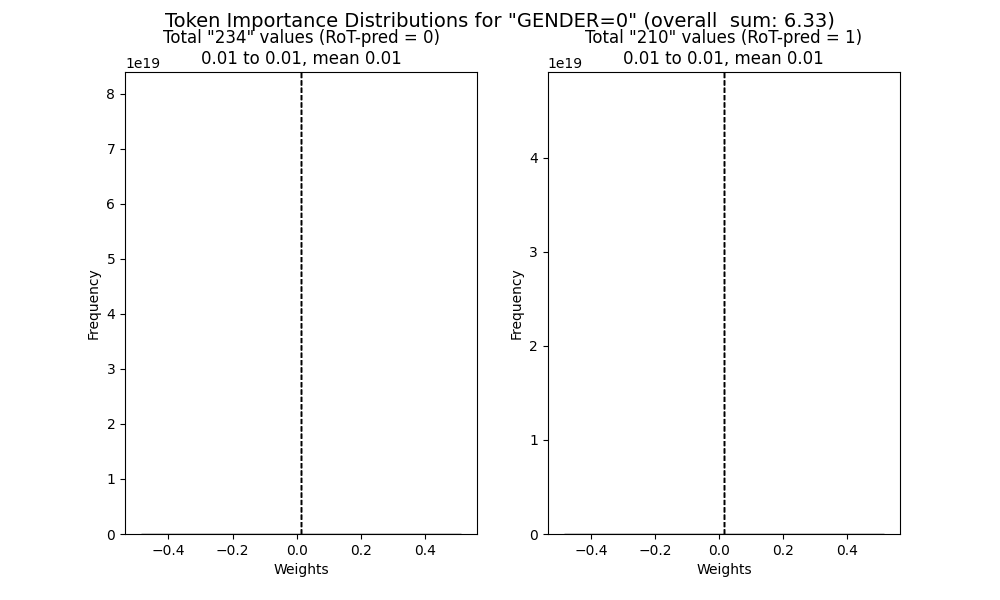
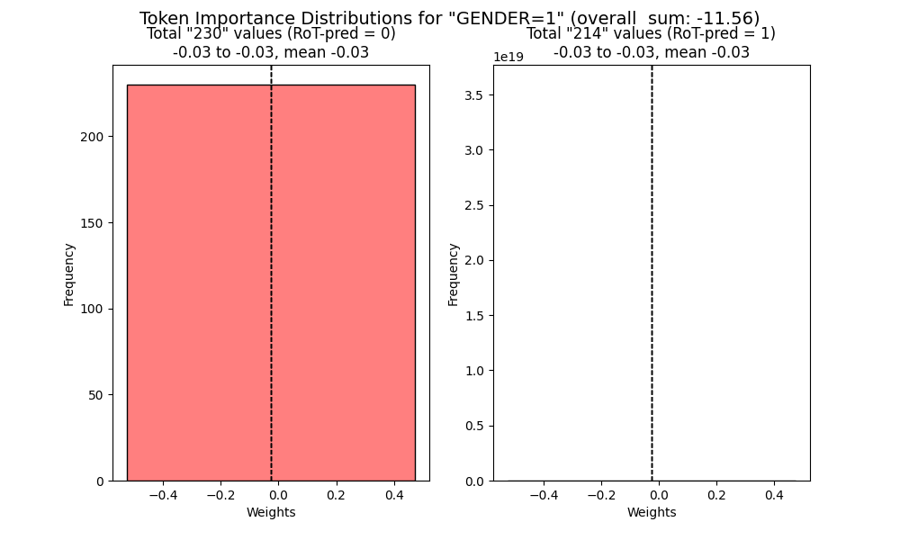

### Race
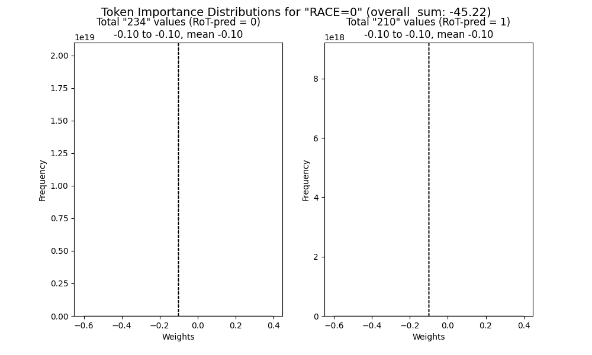
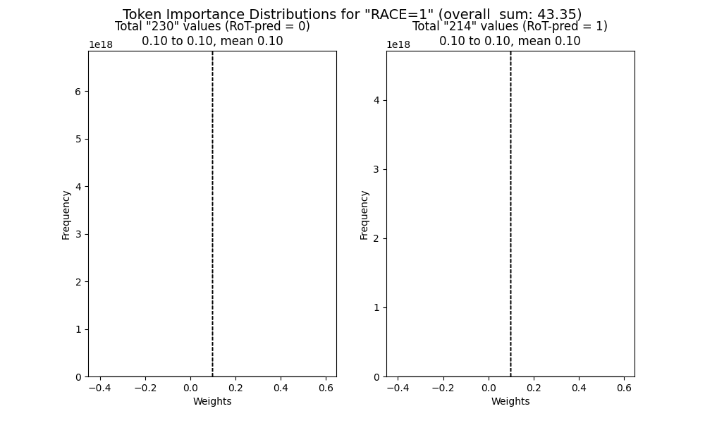

### Party
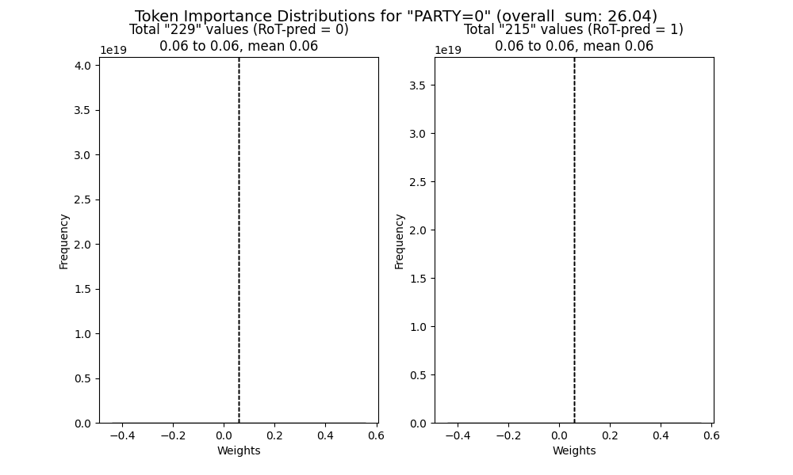
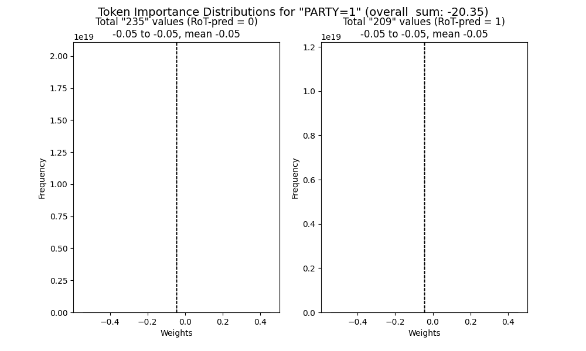

### Others

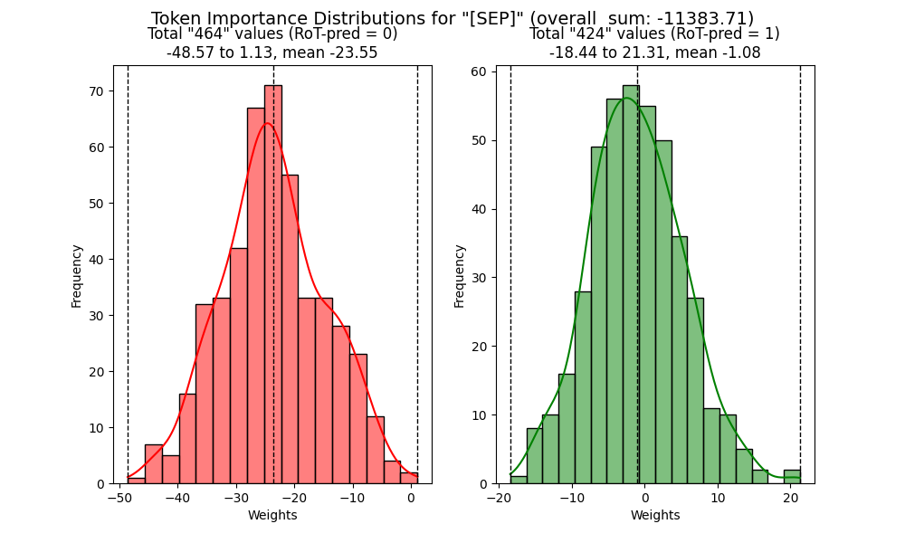
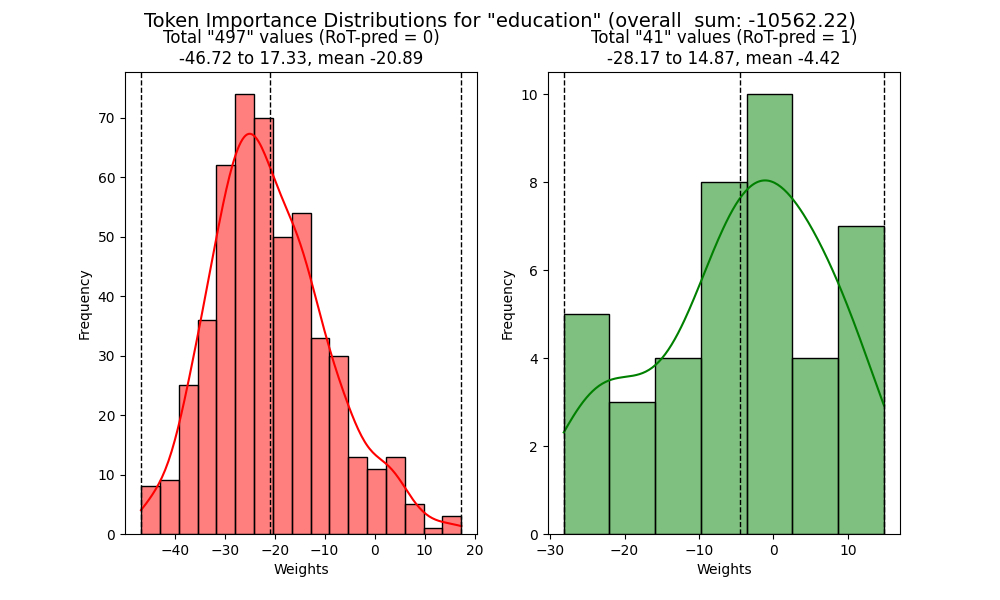
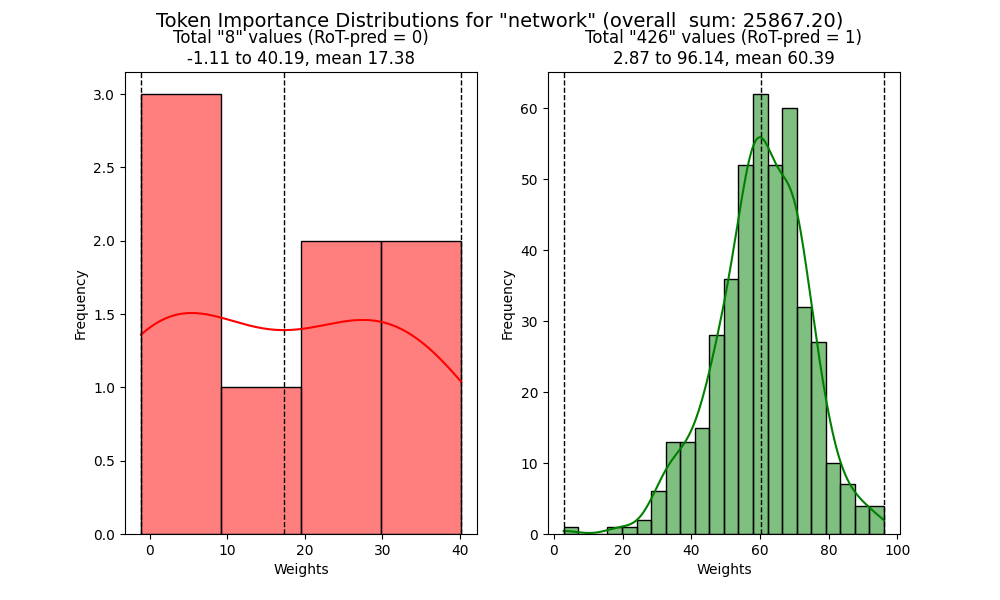
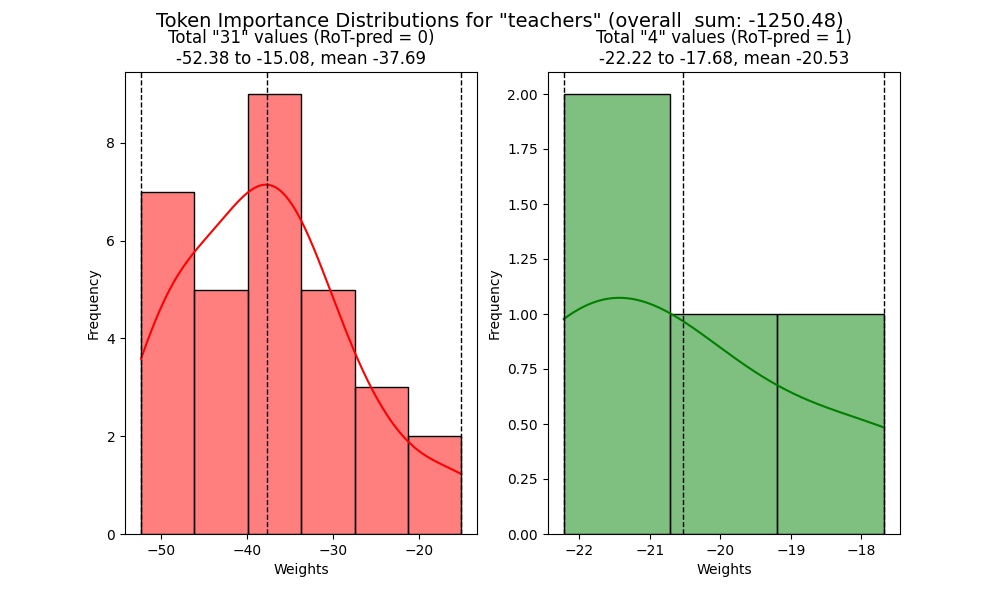
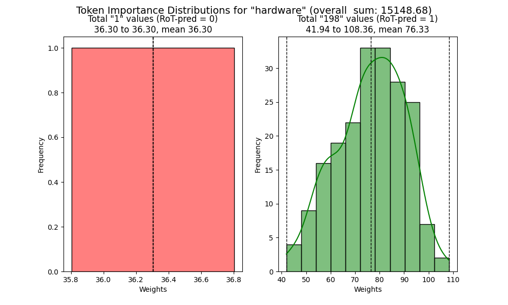
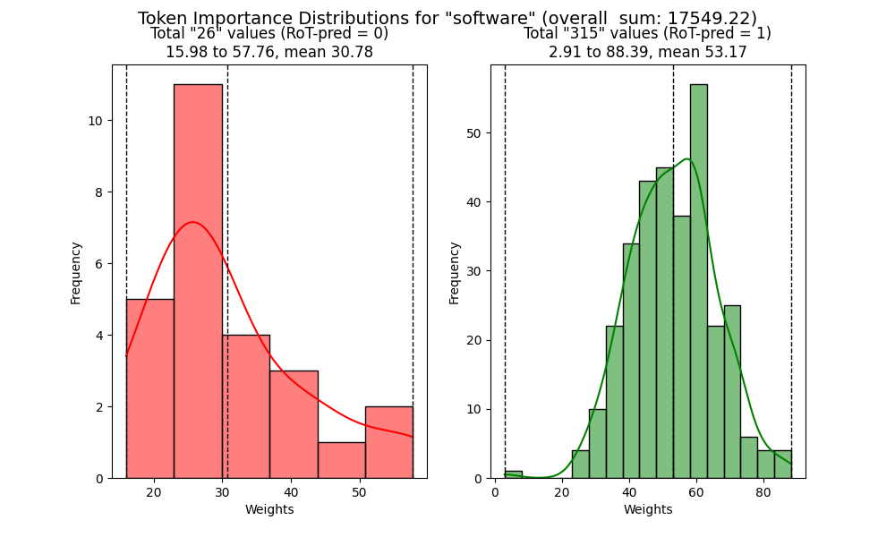
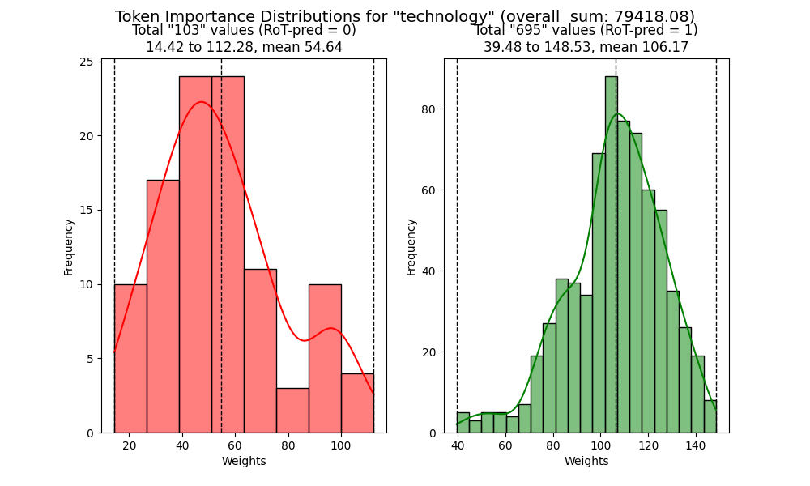
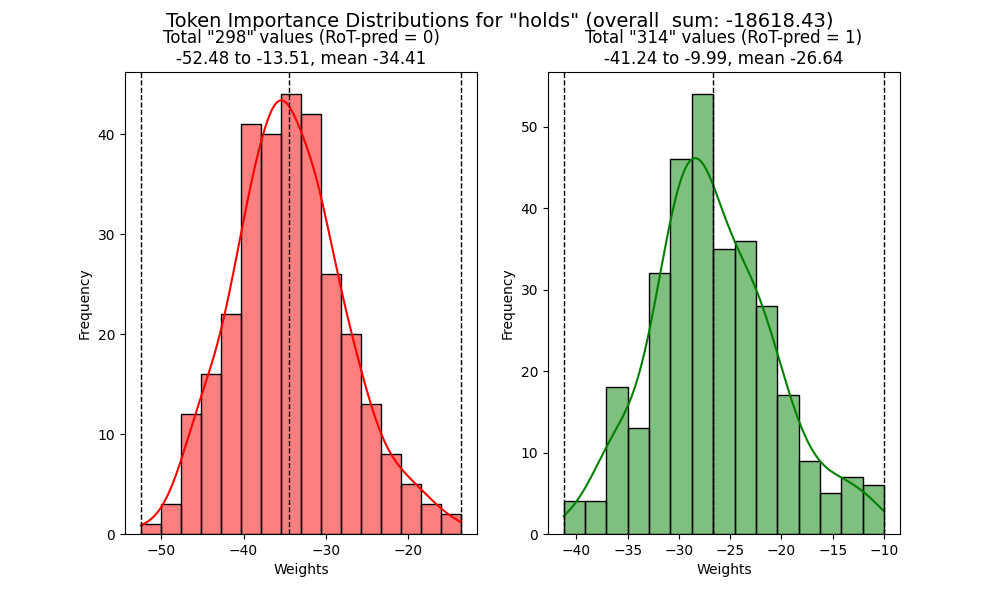
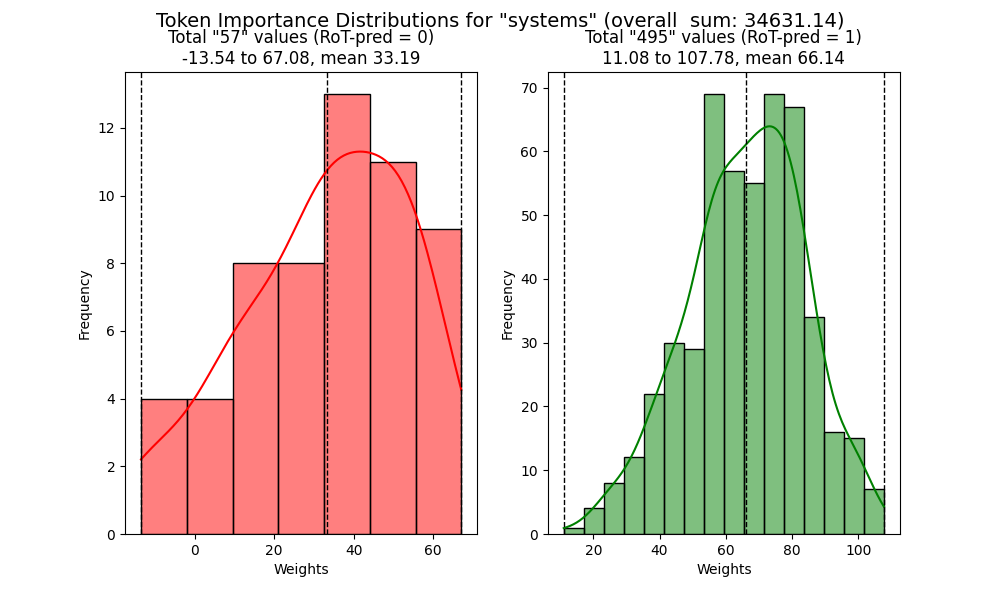
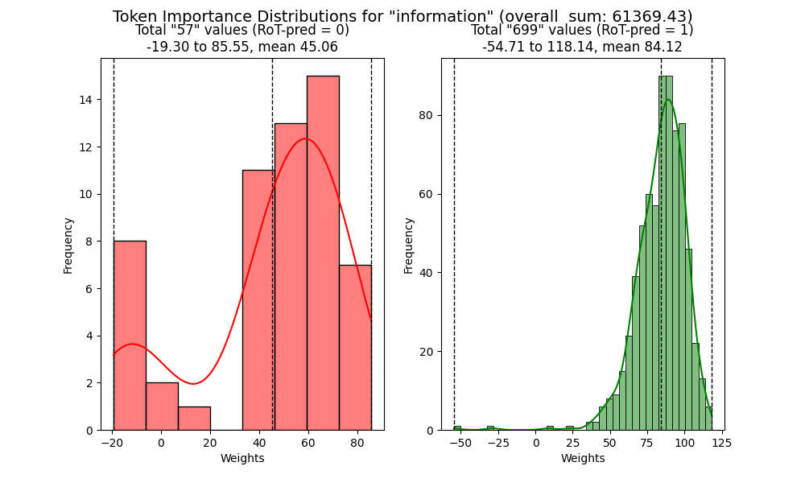
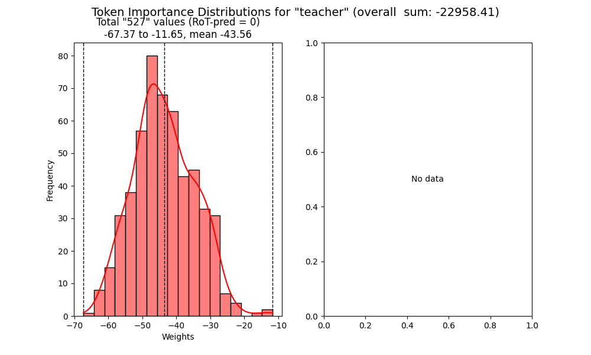
